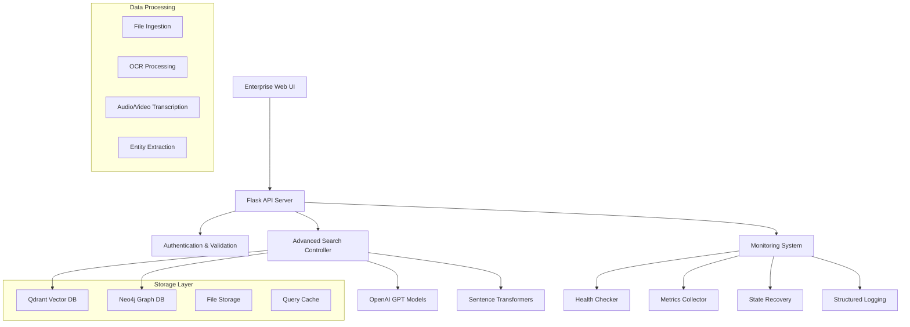

# 🚀 Enterprise RAG Search System

A production-ready, multimodal Retrieval-Augmented Generation (RAG) system that supports text, image, audio, and video ingestion with advanced search capabilities, real-time monitoring, and comprehensive admin controls.


## 🎯 **Key Features**

### 🔍 **Advanced Search & AI**
- **Hybrid Search Engine**: Vector + Graph + Keyword search
- **Multimodal Processing**: Text, images, audio, video support
- **AI-Powered Responses**: GPT-powered answer generation
- **Query Optimization**: Automatic query enhancement and rewriting
- **Entity Recognition**: Advanced NLP for entity extraction
- **Semantic Understanding**: Context-aware search results

### 📊 **Enterprise Monitoring**
- **Real-time Health Monitoring**: System resources, database status
- **Performance Metrics**: Response times, accuracy scores, error rates
- **Error Handling**: Automatic retry mechanisms with exponential backoff
- **Circuit Breaker Pattern**: Graceful failure handling
- **State Recovery**: Automatic service recovery and backup
- **Comprehensive Logging**: Structured JSON logging with context tracking

### 🎨 **Professional UI**
- **Modern Web Interface**: Responsive, professional design
- **6 Feature Tabs**: Search, Advanced Search, File Upload, Metrics, Monitoring, Admin
- **Real-time Updates**: Live system status and metrics
- **Interactive Results**: Expandable images, clickable suggestions
- **Progressive Upload**: Visual progress tracking for file uploads

### 🛡️ **Security & Validation**
- **Input Validation**: XSS prevention and request sanitization
- **Rate Limiting**: Protection against abuse
- **Error Classification**: Comprehensive error categorization
- **Access Control**: Structured permission system
- **Data Validation**: Multi-layer input validation

## 🏗️ **Architecture Overview**



## 🚀 **Quick Start**

### **Prerequisites**
- Python 3.8+
- Docker & Docker Compose
- 8GB+ RAM recommended
- OpenAI API key

### **1. Clone & Setup**
```bash
git clone <repository-url>
cd RAG_Search_KG
python -m venv venv
source venv/bin/activate  # On Windows: venv\Scripts\activate
pip install -r requirements.txt
```

### **2. Environment Configuration**
```bash
cp .env.example .env
# Edit .env with your settings:
OPENAI_API_KEY=your_api_key_here
QDRANT_HOST=localhost
QDRANT_PORT=6333
NEO4J_URI=bolt://localhost:7687
NEO4J_USER=neo4j
NEO4J_PASSWORD=password
LOG_LEVEL=INFO
```

### **3. Start Database Services**
```bash
docker-compose up -d
```

### **4. Launch the System**
```bash
# Clean startup (recommended)
python start_clean.py

# Or standard startup
python app.py
```

### **5. Access the System**
- **Enhanced UI**: http://localhost:5001
- **Basic UI**: http://localhost:5001/basic
- **Health Check**: http://localhost:5001/health

## 📱 **User Interface Guide**

### **🔍 Search Tab**
- **Quick Search**: Basic search with AI responses
- **Live Metrics**: Response time, relevance scores, accuracy
- **Dual Results**: Vector and graph search side-by-side
- **Image Support**: Click to expand document images

### **⚙️ Advanced Search Tab**
- **Search Methods**: Hybrid, Vector-only, Graph-only, Keyword
- **Content Filters**: Text, Images, Audio/Video content
- **Similarity Threshold**: Adjustable relevance threshold
- **Query Expansion**: Automatic or manual query enhancement
- **Quality Indicators**: 🟢 High, 🟡 Medium, 🔴 Low relevance
- **Smart Suggestions**: AI-generated query improvements

### **📤 File Upload Tab**
- **Multimodal Support**: PDF, TXT, DOC, JPG, PNG, MP3, MP4
- **Drag & Drop**: User-friendly file selection
- **Processing Options**: 
  - ✅ Extract Entities
  - ✅ Generate Summary  
  - ✅ Create Relationships
- **Content Categories**: General, Technical, Legal, Medical, Financial
- **Progress Tracking**: Real-time upload and processing status

### **📊 Metrics Tab**
- **Performance Overview**: Total queries, response times, success rates
- **Trend Analysis**: Performance charts and historical data
- **Query History**: Recent search activity
- **Agent Performance**: Vector, Graph, Hybrid search success rates

### **🔧 Monitoring Tab**
- **System Resources**: Live CPU, Memory, Disk usage
- **Database Status**: Qdrant & Neo4j connectivity
- **Service Health**: Detailed health checks with response times
- **Error Tracking**: Recent errors and system issues

### **🛡️ Admin Tab**
- **System Controls**:
  - ⚡ Trigger System Recovery
  - 🗑️ Clear Cache
  - 🚀 Optimize Queries
  - 📥 Export Logs
- **System Information**: Version, uptime, service counts
- **Error Statistics**: Comprehensive error breakdowns
- **Recovery Management**: Manual service recovery

## 🔌 **API Endpoints**

### **Search Endpoints**
```http
POST /search
POST /search_advanced
POST /query_optimize
POST /feedback
```

### **File Management**
```http
POST /upload
GET /images/<filename>
```

### **Monitoring & Health**
```http
GET /health
GET /system/status
GET /system/metrics
GET /system/errors
POST /system/recovery
GET /performance_metrics
```

### **Example API Usage**

#### **Basic Search**
```bash
curl -X POST http://localhost:5001/search \
  -F "query=What is the purchase order number?"
```

#### **Advanced Search**
```bash
curl -X POST http://localhost:5001/search_advanced \
  -F "query=financial reports" \
  -F "session_id=test-session"
```

#### **File Upload**
```bash
curl -X POST http://localhost:5001/upload \
  -F "files=@document.pdf" \
  -F "category=technical" \
  -F "extract_entities=true"
```

#### **Health Check**
```bash
curl http://localhost:5001/health
```

## 📁 **Project Structure**

```
RAG_Search_KG/
├── 📁 monitoring/              # Comprehensive monitoring system
│   ├── __init__.py
│   ├── logger.py              # Structured logging
│   ├── error_handler.py       # Error handling & retry logic
│   ├── health_check.py        # System health monitoring
│   ├── state_recovery.py      # Service recovery
│   ├── metrics_collector.py   # Performance metrics
│   └── input_validation.py    # Input validation & security
├── 📁 search/                  # Advanced search components
│   ├── __init__.py
│   ├── advanced_controller.py # Search orchestration
│   ├── query_optimizer.py     # Query optimization
│   └── multi_agent_search.py  # Multi-agent search
├── 📁 evaluation/              # Evaluation & metrics
│   ├── __init__.py
│   └── metrics.py             # RAG evaluation metrics
├── 📁 templates/               # Web UI templates
│   ├── index.html             # Basic UI
│   └── enhanced_ui.html       # Enterprise UI
├── 📁 tests/                   # Test suites
│   ├── test_monitoring.py
│   └── test_advanced_components.py
├── 📁 ingestion/               # Data ingestion (legacy)
├── 📁 uploaded_files/          # User uploaded files
├── 📁 spdocvqa_images/         # Document images
├── app.py                      # Main Flask application
├── start_clean.py             # Clean startup script
├── docker-compose.yml         # Database services
├── requirements.txt           # Python dependencies
├── .env.example              # Environment template
└── README.md                 # This file
```

## ⚡ **Performance Features**

### **Optimization**
- **Query Caching**: Intelligent query result caching
- **Connection Pooling**: Efficient database connections
- **Lazy Loading**: On-demand resource loading
- **Parallel Processing**: Concurrent search operations
- **Memory Management**: Automatic cleanup and optimization

### **Scalability**
- **Horizontal Scaling**: Microservice-ready architecture
- **Load Balancing**: Ready for multiple instances
- **Caching Layers**: Multiple levels of caching
- **Background Processing**: Async task processing

## 🛠️ **Development**

### **Adding New Features**
1. **Search Agents**: Extend `search/multi_agent_search.py`
2. **Monitoring**: Add components to `monitoring/`
3. **UI Features**: Enhance `templates/enhanced_ui.html`
4. **API Endpoints**: Add routes to `app.py`

### **Running Tests**
```bash
# Run monitoring tests
python -m pytest tests/test_monitoring.py -v

# Run all tests
python -m pytest tests/ -v

# Test system functionality
python monitoring_demo.py
```

### **Development Mode**
```bash
# Start with debug mode
export FLASK_DEBUG=1
python app.py

# Or use development server
flask run --debug --port 5001
```

## 🔧 **Configuration**

### **Environment Variables**
```env
# API Keys
OPENAI_API_KEY=your_openai_key

# Database Configuration
QDRANT_HOST=localhost
QDRANT_PORT=6333
NEO4J_URI=bolt://localhost:7687
NEO4J_USER=neo4j
NEO4J_PASSWORD=password

# System Configuration
LOG_LEVEL=INFO
FLASK_ENV=production
TOKENIZERS_PARALLELISM=false

# Monitoring
HEALTH_CHECK_INTERVAL=60
MAX_RETRY_ATTEMPTS=3
CIRCUIT_BREAKER_THRESHOLD=5
```

### **Docker Services**
```yaml
# Qdrant Vector Database
qdrant:
  image: qdrant/qdrant:latest
  ports: ["6333:6333"]

# Neo4j Graph Database  
neo4j:
  image: neo4j:latest
  ports: ["7474:7474", "7687:7687"]
```

## 📊 **Monitoring & Observability**

### **Health Monitoring**
- **System Resources**: CPU, Memory, Disk usage
- **Database Connectivity**: Qdrant, Neo4j status
- **Service Health**: Component-level health checks
- **Response Times**: Endpoint performance tracking

### **Metrics Collection**
- **Query Metrics**: Volume, latency, success rates
- **User Metrics**: Session tracking, satisfaction scores
- **System Metrics**: Resource utilization, error rates
- **Business Metrics**: Search quality, user engagement

### **Error Handling**
- **Automatic Retry**: Configurable retry with backoff
- **Circuit Breaking**: Prevent cascade failures
- **Graceful Degradation**: Fallback responses
- **Error Classification**: Detailed error categorization

## 🚨 **Troubleshooting**

### **Common Issues**

#### **Port Already in Use**
```bash
# Find process using port 5001
lsof -ti:5001
# Kill the process
kill -9 <process_id>
```

#### **Database Connection Issues**
```bash
# Check Docker services
docker-compose ps
# Restart services
docker-compose restart
```

#### **Memory Issues**
```bash
# Check system resources
python -c "from monitoring.health_check import HealthChecker; h = HealthChecker(); print(h.check_system_resources())"
```

#### **Clear Cache and Reset**
```bash
# Clear query cache
rm -rf query_optimization.db
# Clear logs
rm -rf logs/
# Restart system
python start_clean.py
```

## 📈 **Performance Benchmarks**

| Metric | Target | Typical |
|--------|--------|---------|
| Search Response Time | <2s | ~800ms |
| Vector Search | <500ms | ~200ms |
| Graph Traversal | <1s | ~400ms |
| File Upload | <5s | ~2s |
| Health Check | <100ms | ~50ms |

## 🤝 **Contributing**

1. **Fork the repository**
2. **Create feature branch**: `git checkout -b feature/new-feature`
3. **Add tests** for new functionality
4. **Ensure all tests pass**: `python -m pytest`
5. **Submit pull request** with description

### **Code Standards**
- **Python**: Follow PEP 8
- **Documentation**: Docstrings for all functions
- **Testing**: Unit tests for new features
- **Logging**: Use structured logging
- **Error Handling**: Comprehensive error handling

## 📝 **License**

This project is licensed under the MIT License - see the [LICENSE](LICENSE) file for details.

## 🙏 **Acknowledgments**

- **OpenAI**: GPT models for AI responses
- **Qdrant**: Vector database for semantic search
- **Neo4j**: Graph database for relationship queries
- **Sentence Transformers**: Text embedding models
- **Flask**: Web framework
- **Tailwind CSS**: UI styling

## 📞 **Support**

- **Issues**: [GitHub Issues](https://github.com/your-repo/issues)
- **Documentation**: [Wiki](https://github.com/your-repo/wiki)
- **Discussions**: [GitHub Discussions](https://github.com/your-repo/discussions)

---

## 🎉 **Quick Commands Reference**

```bash
# Start System
python start_clean.py

# Check Health
curl http://localhost:5001/health

# Upload File
curl -X POST http://localhost:5001/upload -F "files=@document.pdf"

# Search
curl -X POST http://localhost:5001/search -F "query=your query"

# View Logs
tail -f logs/app.log

# Stop System
pkill -f python
```

**🚀 Your Enterprise RAG Search System is Ready!**

Access at: http://localhost:5001 